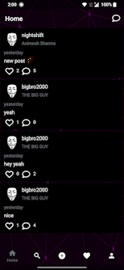
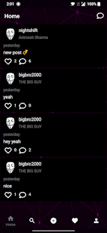

<h1 align="center">Let's Connect</h1> 

  
A simple social media app which includes: 
<b>User registration and login:</b>&nbsp &nbsp Users can create an account and log in to the app using their email address and a password. 
<b>Profile creation:</b>&nbsp &nbsp Users can create a profile that includes their name, profile picture. 
<b>Feed:</b>&nbsp &nbsp Users can view a feed of posts from their friends and followers, as well as posts that are popular within the app. 
<b>Post creation:</b>&nbsp &nbsp Users can create and share text posts with their friends and followers. 
<b>Commenting and liking:</b>&nbsp &nbsp Users can like and comment on posts made by their friends and followers. 
<b>Direct messaging:</b>&nbsp &nbsp Users can send private messages to one another. 
<b>Search:</b>&nbsp &nbsp Users can search for other users within the app. 

 

  
   
 

## Previews

&nbsp;&nbsp;&nbsp;&nbsp;
&nbsp;&nbsp;&nbsp;&nbsp;
&nbsp;&nbsp;&nbsp;&nbsp;
&nbsp;&nbsp;&nbsp;&nbsp;
&nbsp;&nbsp;&nbsp;&nbsp;

## Tech stack & Open-source libraries
- Minimum SDK level 23
- 100% [Kotlin](https://kotlinlang.org/) based + [Coroutines](https://github.com/Kotlin/kotlinx.coroutines) + [Flow](https://kotlin.github.io/kotlinx.coroutines/kotlinx-coroutines-core/kotlinx.coroutines.flow/) for asynchronous.
- Hilt for dependency injection.
- Firestore database for users data storage.
- Firebase Email authentication
- Google Sign in

- Architecture
  - MVVM Architecture (Declarative View - ViewModel - Model)
